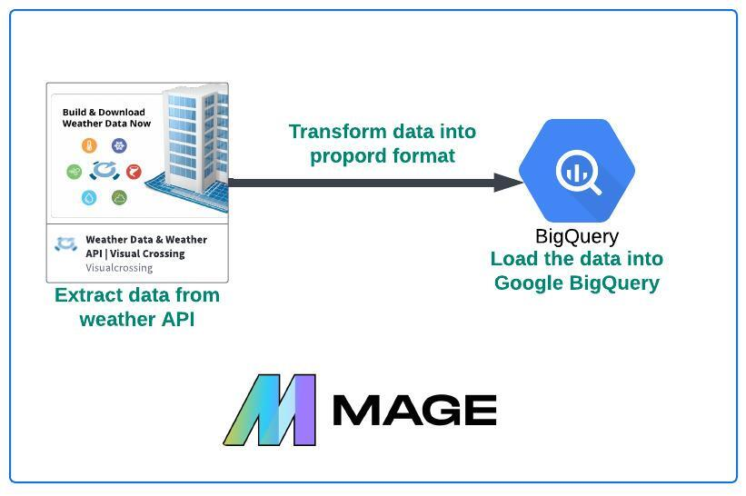
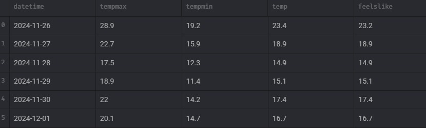
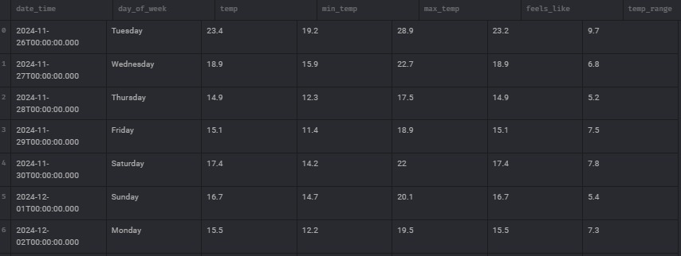
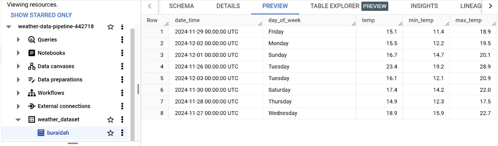
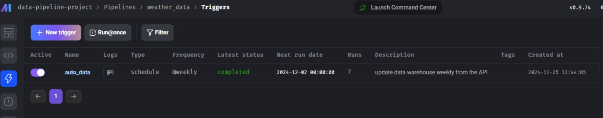
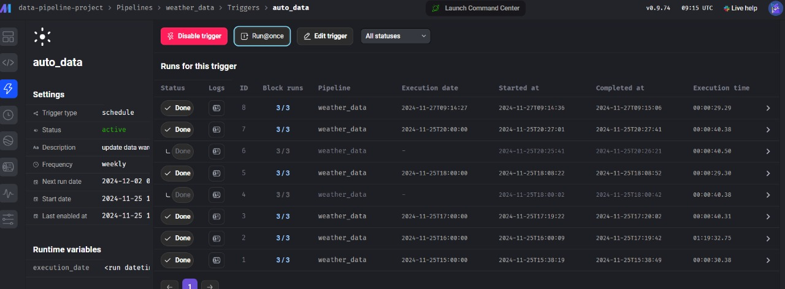
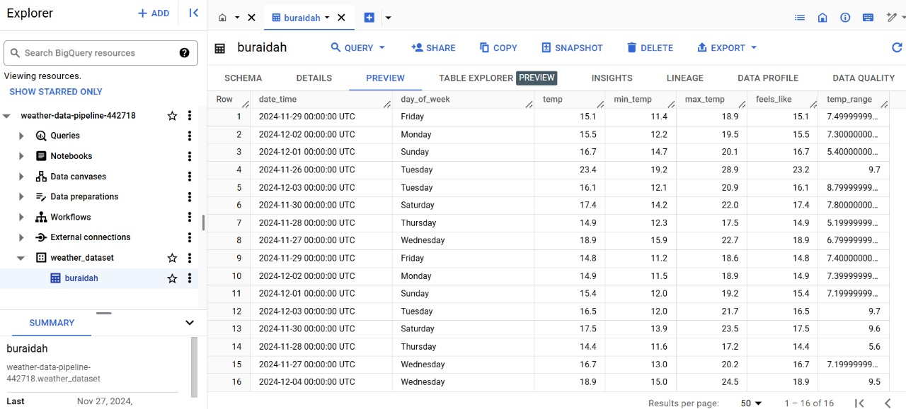

# ETL Data Pipeline using mage.ai and Google Bigquery
 

<be>

## About

This project builds an automated data pipeline to collect, transform, and store weather data for Buraidah city using the [Visual Crossing API](https://www.visualcrossing.com/). 
The pipeline extracts historical weather data weekly, ensuring an up-to-date record of key weather metrics.

## Pipeline Overview:
1. Data Extraction:   
    Fetches data from the Visual Crossing API, including Date and time (datetime), Minimum temperature (min_temp), Maximum temperature (max_temp), Average temperature (temp), and feeling like (feelslike).
   (output)
    

    

  <be>

3. Data Transformation: Converts raw data into a structured format by:
    - Change (datetime) to datetime data type.
    - Renaming and rearranging columns
    - Creating new features like day_of_week (e.g., Monday, Tuesday) and temp_range (difference between max and min temperatures)

    

    

<be>

5. Data Loading: The transformed data is uploaded to BigQuery into a Buraidah table.

 

<be>

6. Automation: This process runs weekly using Mage, an orchestration tool, that automates data pipeline.

 

 

 

 

 

<be>

## Challenges
I am facing issues building a Docker image due to version conflicts between packages. The problem occurred because I had to downgrade google-cloud-bigquery to an older version to make it compatible with the db-dtypes package. However, this downgrade caused a conflict with the mage-ai package. Although the project runs successfully in my Google Cloud virtual instance, I haven't been able to build the Docker image yet. I will keep working on resolving the issue.

## Run the pipeline
1. Install requirements and activate it.
2. include your Google Cloud keys within io_config.yaml
3. Run ` mage start data-pipeline-project` in the terminal to start mage.

